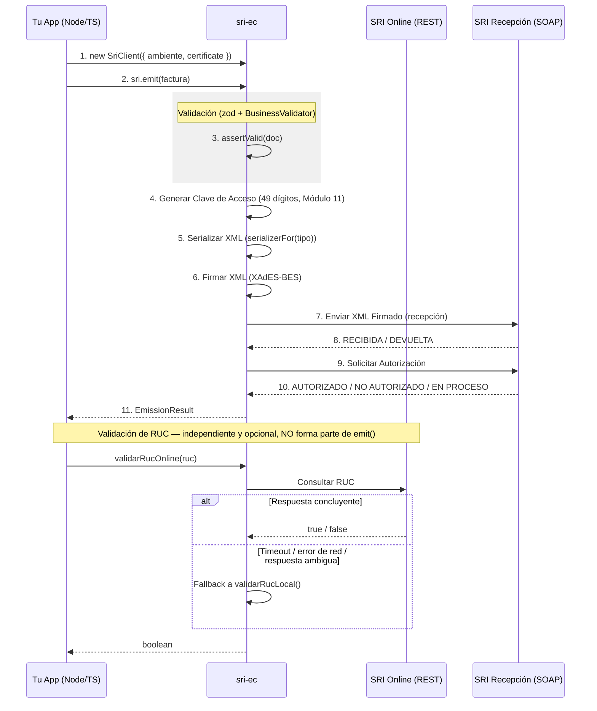

# 🇪🇨 sri-ec (Node.js / TypeScript)

[](https://www.npmjs.com/package/sri-ec) [](LICENSE.md) [](https://nodejs.org/) [](https://paypal.me/teranjona)

Librería profesional para **Facturación Electrónica del SRI Ecuador** en Node.js/TypeScript. Es el port oficial de [`amephia/sri-ec`](https://packagist.org/packages/amephia/sri-ec) (PHP) — misma API 2.0 tipada, misma firma XAdES-BES **verificada byte a byte** contra el paquete original, cero dependencias nativas.

> ☕ **¿Te ahorró horas de trabajo?** Invítame un café en **[paypal.me/teranjona](https://paypal.me/teranjona)** — ¡gracias por apoyar el proyecto!

Este repositorio es un **monorepo npm workspaces** con dos paquetes:

| Paquete | Descripción |
|---|---|
| [`sri-ec`](packages/sri-ec) | Núcleo: documentos, validación, firma, transporte SOAP, envío masivo. Agnóstico de framework. |
| [`sri-ec-nestjs`](packages/nestjs-sri-ec) | Módulo de inyección de dependencias para NestJS sobre el núcleo (`forRoot`/`forRootAsync`). |

## ✨ Características Principales

- ✅ **Firma XAdES-BES con paridad de bytes**: la salida de `XadesSigner` es idéntica, byte a byte (salvo el sufijo aleatorio de los ids), a la del `XadesSigner.php` original — verificado contra fixtures generadas por el propio paquete PHP y contra un oráculo externo (libxml C14N + OpenSSL).
- ✅ **Certificados `.p12`/`.pfx` sin dependencias nativas**: `node-forge` (JS puro) carga certificados modernos y **legacy** (cifrado RC2/3DES pre-2024) de forma nativa — a diferencia del paquete PHP, **no** necesita un fallback a OpenSSL 1.1 (ver [Troubleshooting](#-troubleshooting)).
- ✅ **RSA y ECDSA**, algoritmo de digest configurable (`sha1` por defecto — lo que el SRI valida hoy — o `sha256`).
- ✅ **Los 6 comprobantes electrónicos**: Factura, Liquidación de Compra, Notas de Crédito/Débito, Guía de Remisión y Retención, todos serializables y emitibles con la misma API.
- ✅ **RIDE (PDF + QR)** para los 6 comprobantes vía el subpath opcional `sri-ec/ride` — `pdfkit`/`qrcode` no se instalan ni se cargan si no se usa (ver [RIDE](#-ride-pdf--qr)).
- ✅ **Validación estructural + de negocio**: schemas [zod](https://zod.dev/) (forma, patrones, longitudes) más un `BusinessValidator` que verifica coherencia aritmética (totales, impuestos agregados, retenciones) — **no valida contra XSD** (ver [Troubleshooting](#-troubleshooting)).
- ✅ **Cliente SOAP nativo sobre `fetch`**: sin WSDL ni `SoapClient`, un POST directo a los web services offline del SRI.
- ✅ **Envío masivo (`BatchEmitter`)** con reintentos y backoff exponencial configurables.
- ✅ **Validación de RUC** local (compatible con el comportamiento del PHP) + un algoritmo estricto opt-in (módulo 10/11 real) + verificación online con fallback.
- ✅ **Dual ESM + CommonJS** con tipos TypeScript incluidos (`.d.ts`/`.d.cts`), cero dependencias nativas (nada de `node-gyp`).
- ✅ **Módulo NestJS opcional** (`sri-ec-nestjs`) con el patrón `forRoot()`/`forRootAsync()` estándar del ecosistema Nest.

## 🔐 Certificados de Firma Soportados

El manejo de certificados (números de serie de precisión arbitraria, nombre de emisor en formato RFC 2253, selección de credencial por `keyUsage`/`friendlyName` cuando el `.p12` trae varias claves) es un port línea a línea de `CertificateLoader.php`/`IssuerName.php` — la misma lógica que hace al paquete PHP compatible con:

- **Security Data** (números de serie largos)
- **Uanataca** (cadena de confianza / certificados intermedios)
- **Banco Central del Ecuador (BCE)**
- **ANF AC Ecuador**
- **Consejo de la Judicatura**
- **Datilmedia**
- **Eclipsoft**
- Cualquier otro proveedor que emita certificados X.509 estándar en formato PKCS#12.

## 📋 Tipos de Comprobantes Soportados

Los 6 se construyen como objetos TypeScript tipados (no arrays) y se emiten con el mismo `SriClient.emit(doc)` — el campo discriminante `tipo` decide el serializador, el schema de validación y la clave de acceso correctos.

| Tipo | Código (`codDoc`) | `TipoComprobante` |
|------|--------|--------|
| Factura | 01 | `TipoComprobante.Factura` |
| Liquidación de Compra | 03 | `TipoComprobante.LiquidacionCompra` |
| Nota de Crédito | 04 | `TipoComprobante.NotaCredito` |
| Nota de Débito | 05 | `TipoComprobante.NotaDebito` |
| Guía de Remisión | 06 | `TipoComprobante.GuiaRemision` |
| Comprobante de Retención | 07 | `TipoComprobante.Retencion` |

## 🔄 Flujo de Trabajo



## 🚀 Instalación

```bash
npm install sri-ec
# Opcional, solo para apps NestJS:
npm install sri-ec-nestjs
```

## 🛠 Requisitos

- **Node.js**: `>= 20`
- **Cero dependencias nativas**: `node-forge`, `@xmldom/xmldom`, `fast-xml-parser` y `zod` son JS puro — no hace falta `node-gyp` ni un toolchain de compilación.
- Empaquetado dual ESM/CJS (`import`/`require` funcionan igual) con declaraciones de tipos incluidas.

## 📖 Uso

### Emisión individual

```ts
import { readFileSync } from 'node:fs';
import {
  Ambiente,
  FormaPago,
  loadCertificate,
  SriClient,
  TipoComprobante,
  TipoEmision,
  type Factura,
} from 'sri-ec';

const certificate = loadCertificate(readFileSync('firma.p12'), 'clave-del-p12');

const sri = new SriClient({ ambiente: Ambiente.Pruebas, certificate });

const factura: Factura = {
  tipo: TipoComprobante.Factura,
  infoTributaria: {
    ambiente: Ambiente.Pruebas,
    razonSocial: 'MI EMPRESA S.A.',
    ruc: '1790011001001',
    estab: '001',
    ptoEmi: '001',
    secuencial: '000000001',
    dirMatriz: 'Quito, Ecuador',
    tipoEmision: TipoEmision.Normal,
  },
  fechaEmision: '26/01/2026',
  tipoIdentificacionComprador: '05',
  razonSocialComprador: 'CLIENTE FINAL',
  identificacionComprador: '9999999999',
  totalSinImpuestos: '100.00',
  totalDescuento: '0.00',
  importeTotal: '112.00',
  totalConImpuestos: [
    { codigo: '2', codigoPorcentaje: '2', baseImponible: '100.00', valor: '12.00' },
  ],
  detalles: [
    {
      codigoPrincipal: 'PROD001',
      descripcion: 'Producto de prueba',
      cantidad: '1.00',
      precioUnitario: '100.00',
      descuento: '0.00',
      precioTotalSinImpuesto: '100.00',
      impuestos: [
        { codigo: '2', codigoPorcentaje: '2', tarifa: '12.00', baseImponible: '100.00', valor: '12.00' },
      ],
    },
  ],
  pagos: [{ formaPago: FormaPago.EFECTIVO, total: '112.00' }],
};

const resultado = await sri.emit(factura);

console.log(resultado.status); // 'AUTORIZADO' | 'RECHAZADO' | 'EN_PROCESO'
if (resultado.status === 'AUTORIZADO') {
  console.log(resultado.numeroAutorizacion, resultado.fechaAutorizacion);
} else {
  for (const m of resultado.messages) console.log(`[${m.identificador}] ${m.mensaje}`);
}
```

`Factura` también admite `dirEstablecimiento` y `contribuyenteEspecial` (ambos opcionales, ausentes del ejemplo mínimo de arriba): dirección del establecimiento emisor y número de resolución de contribuyente especial del SRI — el RIDE los imprime en el bloque emisor cuando están presentes (ver [RIDE](#-ride-pdf--qr)).

**Firma del método:** `SriClient.emit(doc: Comprobante, claveAcceso?: string): Promise<EmissionResult>`

`EmissionResult` expone:
- `status` — `'AUTORIZADO' | 'RECHAZADO' | 'EN_PROCESO' | 'ERROR'`
- `claveAcceso`, `signedXml`, `numeroAutorizacion?`, `fechaAutorizacion?`, `authorizedXml?`
- `messages` — `Message[]` con los mensajes crudos del SRI
- `rejectedStage?` — `'RECEPCION'` (el comprobante nunca entró al sistema del SRI) o `'AUTORIZACION'` (entró, pero fue rechazado después), solo presente si `status === 'RECHAZADO'`

Si se pasa `claveAcceso` explícitamente, se verifica antes de firmar: 49 dígitos, dígito verificador Módulo 11 correcto y coherencia campo a campo con el documento (fecha, `codDoc`, RUC, ambiente, serie y secuencial). Una clave arbitraria quedaría firmada dentro del XML, así que se rechaza con `ValidationError`.

Otros métodos de `SriClient`:
- `prepare(doc: Comprobante, claveAcceso?: string): { claveAcceso, signedXml }` — todo lo que hace `emit()` **antes** de tocar la red: validar, calcular la clave, serializar y firmar. Ver [Firmar sin emitir](#firmar-sin-emitir-prepare).
- `authorize(claveAcceso: string): Promise<AuthorizationOutcome>` — re-consulta el estado de una clave ya enviada (útil para un `EN_PROCESO`).
- `sign(xml: string): string` — solo firma un XML ya serializado, sin enviarlo.

#### ⚠️ Fallos de comunicación: nunca reintente con `emit()`

Un `CommunicationError` (timeout, red caída, fallo SOAP) **no** se convierte en `EmissionResult`: se propaga como excepción, porque a diferencia de un rechazo del SRI (una respuesta válida con estado desfavorable), un fallo de comunicación no permite saber si el comprobante llegó a procesarse.

El error **lleva adjunto el comprobante en vuelo** (`claveAcceso` y `signedXml`) precisamente para que esa evidencia no se pierda:

```ts
import { CommunicationError } from 'sri-ec';

try {
  await sri.emit(factura);
} catch (err) {
  if (err instanceof CommunicationError && err.claveAcceso) {
    // 1. PERSISTA el par antes de hacer nada más.
    await repositorio.guardar(err.claveAcceso, err.signedXml!);

    // 2. Resuelva el estado real consultando la clave, NO reemitiendo.
    const estado = await sri.authorize(err.claveAcceso);
    console.log(estado.estado); // AUTORIZADO / EN PROCESO / NO AUTORIZADO...
  }
  throw err;
}
```

**Reintentar con un `emit()` nuevo es siempre incorrecto**: cada llamada genera un código numérico aleatorio distinto, así que produciría *otra* clave de acceso — el comprobante original (que el SRI puede haber aceptado) quedaría irresoluble y el secuencial se duplicaría.

### Firmar sin emitir (`prepare`)

`prepare()` devuelve el comprobante listo para despachar sin contactar al SRI. Es el puente soportado hacia `BatchEmitter`, hacia una cola de trabajos o hacia un transporte propio:

```ts
const { claveAcceso, signedXml } = sri.prepare(factura);

// Persista SIEMPRE el par antes de enviarlo: una vez que el XML sale a la
// red, la claveAcceso es el único identificador con el que se puede resolver
// el comprobante ante el SRI.
await repositorio.guardar(claveAcceso, signedXml);
```

Acepta el mismo `claveAcceso` opcional que `emit()` (con la misma verificación) y lanza los mismos `ValidationError`.

### Envío masivo (`BatchEmitter`)

`BatchEmitter` trabaja sobre pares `(claveAcceso, signedXml)` ya listos. Para obtenerlos a partir de sus documentos, use `SriClient.prepare()` — es exactamente la mitad local de `emit()`:

```ts
import { Ambiente, BatchEmitter, loadCertificate, SriClient } from 'sri-ec';

const certificate = loadCertificate(readFileSync('firma.p12'), process.env['SRI_P12_PASSWORD']!);
const sri = new SriClient({ ambiente: Ambiente.Produccion, certificate });
const batch = new BatchEmitter({ ambiente: Ambiente.Produccion });

for (const doc of documentos) {
  const { claveAcceso, signedXml } = sri.prepare(doc); // valida + clave + serializa + firma
  await repositorio.guardar(claveAcceso, signedXml);   // persistir ANTES de enviar
  batch.add(claveAcceso, signedXml);                   // idempotente por clave de acceso
}

await batch.run(); // procesa hasta agotar pendientes, maxPasses, o quedarse sin progreso — y RETORNA

console.log(batch.status()); // { PENDING: 0, SENT: 0, AUTHORIZED: 1, REJECTED: 0, IN_PROCESS: 1, FAILED: 0 }
```

**`BatchEmitter.run()` nunca espera internamente.** Cuando una pasada no logra avanzar ningún comprobante (p. ej. todos quedaron `EN_PROCESO`, esperando a que el SRI termine de procesarlos), `run()` retorna de inmediato — el *pacing* y la reinvocación son responsabilidad del caller (un worker de cola o un cron), exactamente igual que en el paquete PHP. Un worker mínimo:

```ts
import { Ambiente, BatchEmitter, RetryPolicy } from 'sri-ec';

const retryPolicy = new RetryPolicy(); // maxAttempts=5, baseDelaySeconds=3, maxDelaySeconds=600
const batch = new BatchEmitter({ ambiente: Ambiente.Produccion, retryPolicy });

// ... poblar `batch` con `batch.add(claveAcceso, signedXml)` ...

async function drenarLote(intento = 1): Promise<void> {
  await batch.run();

  const { SENT, IN_PROCESS } = batch.status();
  if (SENT + IN_PROCESS === 0) return; // terminado: solo quedan estados terminales

  const esperaMs = retryPolicy.delaySeconds(intento) * 1000;
  await new Promise((resolve) => setTimeout(resolve, esperaMs));
  await drenarLote(intento + 1);
}

await drenarLote();
console.log(batch.status());
```

En producción, reemplace el `setTimeout` recursivo por un job encolado con retraso (BullMQ, SQS con `DelaySeconds`, un cron cada N minutos, etc.) — `RetryPolicy.delaySeconds(intento)` está expuesto justamente para que ese scheduler externo calcule cuánto esperar.

**Métodos de `BatchEmitter`:**
- `add(claveAcceso: string, signedXml: string): void` — idempotente por clave de acceso.
- `run(opts?: { maxPasses?: number }): Promise<void>` — procesa los pendientes; reanudable.
- `status(): Record<ComprobanteState, number>` — conteo por los 6 estados (`PENDING | SENT | AUTHORIZED | REJECTED | IN_PROCESS | FAILED`), siempre con las 6 claves presentes.
- `result(claveAcceso: string): BatchItem | undefined` — estado de un comprobante individual.

### Validación de RUC

```ts
import { validarRucLocal, validarRucChecksum, validarRucOnline } from 'sri-ec';

validarRucLocal('1790011001001');                       // compatible con el PHP: solo estructura superficial
validarRucLocal('1790011001001', { checksum: true });    // + módulo 10/11 real + código de provincia
validarRucChecksum('1790011001001');                     // el algoritmo estricto por sí solo

await validarRucOnline('1790011001001');                 // local + verificación REST contra el SRI, con fallback a local si la red falla
```

`validarRucLocal()` reproduce **a propósito** la validación superficial del `BusinessValidator.php` original (tercer dígito de régimen + establecimiento ≠ `"000"`, sin módulo 10/11 ni provincia) — es la validación que corre internamente `assertValid()`/`SriClient.emit()`. `{ checksum: true }` y `validarRucChecksum()` son una extensión de este port: el algoritmo real ecuatoriano, opt-in y aditivo.

### Convenciones de nomenclatura (español/inglés)

La API pública mezcla los dos idiomas **a propósito**, con una regla simple:

| Ámbito | Idioma | Ejemplos |
|---|---|---|
| Conceptos del dominio SRI — todo lo que tiene un nombre oficial en la ficha técnica, el XSD o los web services | **Español**, con la grafía del SRI | `generarClaveAcceso`, `claveAcceso`, `infoTributaria`, `SriTransport.enviar`/`autorizar` (las operaciones SOAP se llaman así), `validarRucLocal`, `TipoComprobante`, `Ambiente`, `docsSustento` |
| Infraestructura genérica — nombres que no describen nada específico del SRI | **Inglés** | `SriClient.emit`/`prepare`/`authorize`/`sign`, `loadCertificate`, `toCents`, `BatchEmitter`, `RetryPolicy`, `Clock` |

El criterio es que un desarrollador con la documentación del SRI abierta pueda buscar el término oficial (`claveAcceso`, `autorizacionComprobante`) y encontrarlo literal en el código, mientras que las piezas de plomería siguen la convención habitual del ecosistema Node. Los nombres en español replican además, uno a uno, los del paquete PHP original.

Todos los **campos de los documentos** (`Factura`, `Retencion`, …) están en español sin excepción: son los nombres de elemento del XSD del SRI, y cambiarlos rompería la correspondencia con el XML generado.

### Transporte

`FetchSoapTransport` (por defecto, sobre `fetch` nativo) es la única implementación incluida — no hay equivalente al `SoapClientTransport` de `ext-soap` porque Node no lo necesita. `SriClient`/`BatchEmitter` aceptan cualquier objeto que implemente la interfaz `SriTransport` (`enviar`/`autorizar`), útil para inyectar un mock en tests o un transporte propio (p. ej. con retries/proxy).

### NestJS (`sri-ec-nestjs`)

```ts
import { readFileSync } from 'node:fs';
import { Module } from '@nestjs/common';
import { Ambiente } from 'sri-ec';
import { SriModule } from 'sri-ec-nestjs';

@Module({
  imports: [
    SriModule.forRoot({
      ambiente: Ambiente.Pruebas,
      certificate: {
        p12: readFileSync('firma.p12'),
        password: process.env['SRI_P12_PASSWORD']!,
      },
      // isGlobal: true,   // opcional, false por defecto
      // validate: false,  // opcional, salta assertValid() antes de firmar
    }),
  ],
})
export class AppModule {}
```

```ts
import { Injectable } from '@nestjs/common';
import type { Factura } from 'sri-ec';
import { SriService } from 'sri-ec-nestjs';

@Injectable()
export class FacturacionService {
  constructor(private readonly sri: SriService) {}

  emitirFactura(factura: Factura) {
    return this.sri.emit(factura); // delega en SriClient.emit()
  }

  firmarSinEnviar(factura: Factura) {
    return this.sri.prepare(factura); // { claveAcceso, signedXml }, sin tocar la red
  }

  loteMasivo() {
    return this.sri.createBatch(); // BatchEmitter preconfigurado con el ambiente/transport del módulo
  }
}
```

Para configuración asíncrona (leer el certificado de un `ConfigService`, un secret manager, etc.) use `SriModule.forRootAsync({ imports, inject, useFactory })` — mismo patrón que `ConfigModule.forRootAsync`/`TypeOrmModule.forRootAsync`. `certificate` acepta un `Certificate` ya cargado (`loadCertificate()` propio) o el par crudo `{ p12, password }`, que el módulo carga internamente.

El certificado se resuelve **antes** de que nada entre al contenedor de DI: bajo el token `SRI_MODULE_OPTIONS` solo queda la configuración no sensible (`ambiente`, `transport`, `validate`). Ni el `.p12` ni su contraseña se registran, para que un volcado del contenedor o una traza de error de Nest no puedan exponerlos.

Como consecuencia, `SriModule.forRoot()` carga el certificado **al evaluar la definición del módulo** (en la propia llamada a `forRoot()`, antes de que Nest compile nada): un `.p12` corrupto o una contraseña incorrecta fallan de inmediato, en el import del módulo, con `CertificateError`, en vez de en la primera inyección de `SriService`/`SRI_CLIENT`. Con `forRootAsync()` la carga ocurre al ejecutarse la `useFactory`, durante la compilación del módulo.

## 🧾 RIDE (PDF + QR)

El RIDE (Representación Impresa del Documento Electrónico) es el PDF legible — con el mismo contenido tributario del XML más un código QR — que se entrega junto al comprobante. Vive en un **subpath aparte**, `sri-ec/ride`: el core de `sri-ec` no lo importa nunca, así que quien solo emite/firma comprobantes no paga el costo de sus dependencias.

`pdfkit` (dibujo del PDF) y `qrcode` (el código QR) son **dependencias opcionales** (`peerDependencies` + `peerDependenciesMeta` opcional — deliberadamente **no** `optionalDependencies`, que npm sí instala por defecto) — instálalas solo si vas a generar el RIDE:

```bash
npm install pdfkit qrcode
```

Si faltan al llamar a `generarRide()`, la librería lanza un `SriError` (`code: 'RIDE_MISSING_DEPENDENCY'`) con el mensaje exacto de qué instalar, en vez de dejar escapar el error crudo de Node:

```
Para generar el RIDE instala las dependencias opcionales: npm install pdfkit qrcode
```

```ts
import { readFileSync, writeFileSync } from 'node:fs';
import { generarRide } from 'sri-ec/ride';

// `resultado` es el EmissionResult de `sri.emit(factura)` (ver Uso más arriba).
const pdf: Uint8Array = await generarRide({
  documento: factura, // cualquiera de los 6 comprobantes (unión `Comprobante`)
  claveAcceso: resultado.claveAcceso,
  autorizacion: // opcional: ver más abajo
    resultado.status === 'AUTORIZADO'
      ? { numero: resultado.numeroAutorizacion!, fecha: resultado.fechaAutorizacion! }
      : undefined,
  logo: readFileSync('logo.png'), // opcional, PNG/JPG del emisor
  opciones: {
    tamano: 'A4', // 'A4' | 'LETTER', default 'A4'
    codigoBarras: true, // código de barras Code 128 de la clave de acceso, default true
    incluirQr: false, // QR (alternativa al código de barras), default false
  },
});

writeFileSync('factura.pdf', pdf);
```

`generarRide()` despacha por `documento.tipo` y cubre los **6 comprobantes** (Factura, Liquidación de Compra, Notas de Crédito/Débito, Guía de Remisión, Retención) con la misma llamada. También hay un atajo por tipo si el discriminado automático no hace falta: `generarRideFactura`, `generarRideLiquidacionCompra`, `generarRideNotaCredito`, `generarRideNotaDebito`, `generarRideGuiaRemision`, `generarRideRetencion` — todos exportados desde `sri-ec/ride`.

El layout sigue las maquetas del **Anexo 2 de la Ficha Técnica** del SRI: cabecera de dos columnas (logo y datos del emisor a la izquierda; R.U.C., nombre del comprobante, autorización y clave de acceso a la derecha), banda del sujeto a todo el ancho, tabla de detalles y pie de dos columnas con la información adicional y las formas de pago a la izquierda y los totales a la derecha.

Bajo el rótulo `CLAVE DE ACCESO` se imprime un **código de barras Code 128** con los 49 dígitos de la clave debajo, que es lo que muestra la maqueta oficial (la nota al pie de la página 56 aclara que el código de barras es opcional: `codigoBarras: false` lo omite sin quitar la clave impresa). El código de barras se dibuja con vectores y solo necesita `pdfkit`. `incluirQr: true` añade el QR de v0.2.0 como alternativa —requiere la dependencia opcional `qrcode`— y codifica la misma clave de acceso: es lo único que el portal de verificación del SRI necesita para consultar el comprobante.

`autorizacion` es opcional: el SRI autoriza de forma asíncrona, así que si el RIDE se imprime antes de recibir la respuesta (o la autorización nunca llegó), el PDF se genera igual — con la cabecera marcada como **"NO AUTORIZADO"** en vez de mostrar número y fecha de autorización.

Ejemplo completo y compilable (emitir con `SriClient` y generar el RIDE del resultado, con `node:fs`): [`examples/generar-ride.ts`](examples/generar-ride.ts).

## 📂 Estructura del Proyecto

```
packages/
├── sri-ec/                        # sri-ec (núcleo)
│   └── src/
│       ├── catalogs/              # Ambiente, TipoComprobante, TipoEmision, FormaPago
│       ├── documents/             # Factura, LiquidacionCompra, NotaCredito, NotaDebito, GuiaRemision, Retencion
│       ├── schemas/                # Validación zod + BusinessValidator (coherencia aritmética)
│       ├── xml/                   # Serializadores XML (uno por tipo de comprobante)
│       ├── signing/                # loadCertificate() (node-forge) + XadesSigner (XAdES-BES)
│       ├── transport/              # Envelopes SOAP + FetchSoapTransport + URLs por ambiente
│       ├── batch/                  # BatchEmitter, BatchProcessor, RetryPolicy
│       ├── utils/                  # generarClaveAcceso (Módulo 11), RUC, montos decimal-seguros
│       ├── emission/                # EmissionResult, EmissionStatus, Message
│       ├── ride/                    # RIDE (PDF+QR), subpath opcional `sri-ec/ride` — pdfkit/qrcode
│       ├── errors/                  # SriError y subclases (ValidationError, CertificateError, ...)
│       └── sri-client.ts           # SriClient — orquestador de alto nivel
└── nestjs-sri-ec/                  # sri-ec-nestjs (wiring de DI, sin lógica propia)
    └── src/
        ├── sri.module.ts           # SriModule.forRoot()/forRootAsync()
        ├── sri.service.ts          # SriService — fachada inyectable de SriClient
        ├── interfaces.ts
        └── tokens.ts

examples/                           # Ejemplos ejecutables (ver más abajo)
```

## 🔐 Estructura de Firma XAdES-BES

Igual que el paquete PHP (ver `XadesSigner` para el detalle byte a byte):

```xml
<ds:Signature>
    <ds:SignedInfo>
        <ds:Reference Id="SignedPropertiesID..." Type="http://uri.etsi.org/01903#SignedProperties" URI="#Signature...-SignedProperties...">...</ds:Reference>
        <ds:Reference Id="Reference-ID-..." URI="#comprobante">...</ds:Reference>
    </ds:SignedInfo>
    <ds:SignatureValue>...</ds:SignatureValue>
    <ds:KeyInfo>
        <ds:X509Data>
            <ds:X509Certificate>...</ds:X509Certificate>
        </ds:X509Data>
        <ds:KeyValue>
            <ds:RSAKeyValue>
                <ds:Modulus>...</ds:Modulus>
                <ds:Exponent>...</ds:Exponent>
            </ds:RSAKeyValue>
        </ds:KeyValue>
    </ds:KeyInfo>
    <ds:Object>
        <etsi:QualifyingProperties>
            <etsi:SignedProperties>
                <etsi:SignedSignatureProperties>
                    <etsi:SigningTime>...</etsi:SigningTime>
                    <etsi:SigningCertificate>
                        <etsi:Cert>
                            <etsi:CertDigest>...</etsi:CertDigest>
                            <etsi:IssuerSerial>...</etsi:IssuerSerial>
                        </etsi:Cert>
                    </etsi:SigningCertificate>
                </etsi:SignedSignatureProperties>
                <etsi:SignedDataObjectProperties>
                    <etsi:DataObjectFormat ObjectReference="#Reference-ID-...">
                        <etsi:Description>Comprobante electrónico SRI Ecuador</etsi:Description>
                        <etsi:MimeType>text/xml</etsi:MimeType>
                    </etsi:DataObjectFormat>
                </etsi:SignedDataObjectProperties>
            </etsi:SignedProperties>
        </etsi:QualifyingProperties>
    </ds:Object>
</ds:Signature>
```

`etsi:Description` (`'Comprobante electrónico SRI Ecuador'` por defecto) es configurable vía `new XadesSigner({ description: '...' })` — no lleva ninguna marca de terceros. `digestAlgorithm` acepta `'sha1'` (por defecto, lo que el SRI valida hoy) o `'sha256'`.

## 🧪 Ejemplos

- [`examples/emitir-factura.ts`](examples/emitir-factura.ts) — carga un certificado, arma una factura mínima y la emite contra el SRI de pruebas.
- [`examples/lote-con-prepare.ts`](examples/lote-con-prepare.ts) — envío masivo a partir de documentos: `sri.prepare(doc)` → persistir → `batch.add()` → drenar el lote con el pacing de `RetryPolicy`.
- [`examples/generar-ride.ts`](examples/generar-ride.ts) — emite una factura con `SriClient` y genera su RIDE (`sri-ec/ride`) a partir del resultado, escribiendo el PDF a disco con `node:fs`.
- [`examples/smoke-pruebas-sri.ts`](examples/smoke-pruebas-sri.ts) — smoke test paso a paso (certificado → clave de acceso → firma → recepción → autorización) contra el SRI de pruebas real, leyendo `SRI_P12_PATH`/`SRI_P12_PASSWORD`/`SRI_RUC` de variables de entorno. **Contacta el servicio real del SRI — no es un mock.**

Todos se verifican con `tsc --noEmit` (`npm run typecheck:examples`), pero no se ejecutan como parte del build ni de los tests: requieren un certificado real.

## 🔧 Troubleshooting

### Certificados legacy (RC2/3DES) — a diferencia del paquete PHP, **no requiere nada especial**

El paquete PHP necesita OpenSSL 1.1 (vía `brew install openssl@1.1` u homólogo) para leer certificados `.p12` legacy (pre-2024, cifrados con RC2/3DES), porque OpenSSL 3.0+ los rechaza por defecto. **Este port no tiene ese problema**: `loadCertificate()` usa `node-forge` (una implementación JS pura de PKCS#12), que descifra RC2/3DES de forma nativa sin depender de la versión de OpenSSL del sistema. Certificados modernos y legacy funcionan igual, sin configuración adicional.

### "FECHA EMISIÓN EXTEMPORÁNEA" o inconsistencias de hora en la firma

`etsi:SigningTime` (dentro de la firma XAdES) usa la hora **local del proceso** de Node, igual que `DateTimeImmutable` en PHP. Si el proceso corre en un servidor con otra zona horaria, la hora de firma no coincidirá con la de Ecuador y el SRI puede rechazar el comprobante.

**Solución:** ejecute el proceso con `TZ=America/Guayaquil`:

```bash
TZ=America/Guayaquil node dist/mi-app.js
```

o fíjela en código antes de firmar/emitir:

```ts
process.env.TZ = 'America/Guayaquil';
```

### No hay validación contra XSD

A diferencia del paquete PHP (que valida contra los `.xsd` oficiales del SRI), este port valida con **schemas zod** (estructura, patrones, longitudes — equivalentes a las restricciones del XSD) más un `BusinessValidator` que verifica coherencia aritmética (sumas de detalles, impuestos agregados, retenciones). Esto cubre los errores más comunes antes de firmar/enviar, pero no es una validación XSD formal. Si su flujo depende de esa garantía exacta, haga siempre un smoke test contra el ambiente de **pruebas** del SRI (`Ambiente.Pruebas`) antes de pasar a producción — vea `examples/smoke-pruebas-sri.ts`.

### `BatchEmitter.run()` "no hace nada" en la segunda llamada

Es el comportamiento esperado: `run()` avanza los comprobantes pendientes mientras haya progreso, y retorna en cuanto una pasada completa no cambia ningún estado (p. ej. todos siguen `EN_PROCESO`). No reintenta ni espera por su cuenta — debe reinvocarlo usted, después de una pausa (`RetryPolicy.delaySeconds()` le da el tiempo sugerido), desde un worker de cola o un cron. Ver [Envío masivo](#envío-masivo-batchemitter) más arriba.

### `ValidationError` con muchos mensajes a la vez

`assertValid()` (y por tanto `SriClient.emit()`) acumula **todos** los errores de zod y de `BusinessValidator` en una sola excepción — revise `error.errors` (un `string[]`), no solo `error.message`.

## 👨‍💻 Desarrollo (monorepo)

```bash
npm install        # instala y enlaza los workspaces
npm run build      # tsup en ambos paquetes (ESM + CJS + .d.ts)
npm test           # vitest run en ambos paquetes
npm run typecheck  # tsc --noEmit sobre src + test de ambos paquetes, y examples/
```

`npm run build` va antes que `typecheck`/`test`: `sri-ec-nestjs` consume los tipos de `sri-ec` desde su `dist/`. Es el mismo orden que ejecuta la CI ([`.github/workflows/ci.yml`](.github/workflows/ci.yml), matriz Node 20 y 22 en cada push y PR).

El `workspaces` de la raíz (`package.json`) es un **array explícito y ordenado** (`["packages/sri-ec", "packages/nestjs-sri-ec"]`), no un glob — al añadir un paquete nuevo hay que agregarlo manualmente a esa lista.

## 📄 Licencia

Licencia MIT. Por favor consulta el [Archivo de Licencia](LICENSE.md) para más información.

---
Desarrollado con ❤️ por [Jonathan Terán](https://github.com/JonathanTeran) — port de [`amephia/sri-ec`](https://github.com/JonathanTeran/teran-sri-ec) (PHP).
